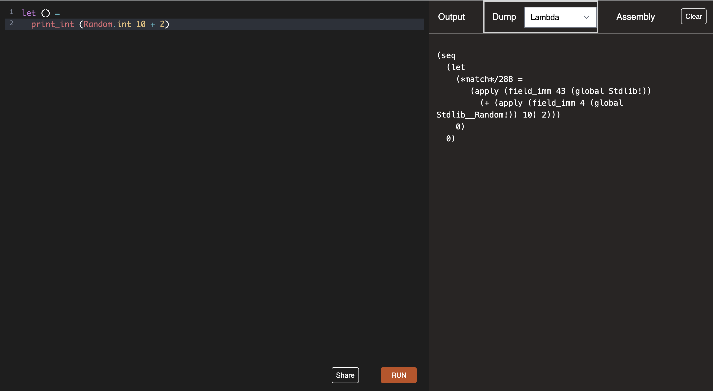

js_of_ocamlopt
--------------

[Give it a go!](https://patricoferris.github.io/js_of_ocamlopt)

Js_of_ocamlopt allows you to explore the **intermediate representations** (IRs) of
simple OCaml programs in the browser. Simply type out your program and select
the IRs you want to see the output. This can also compile all the way to
assembly too, completely in the client with no server required.

